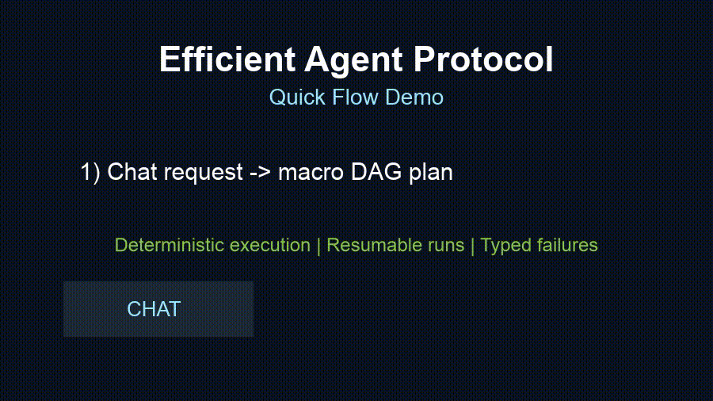
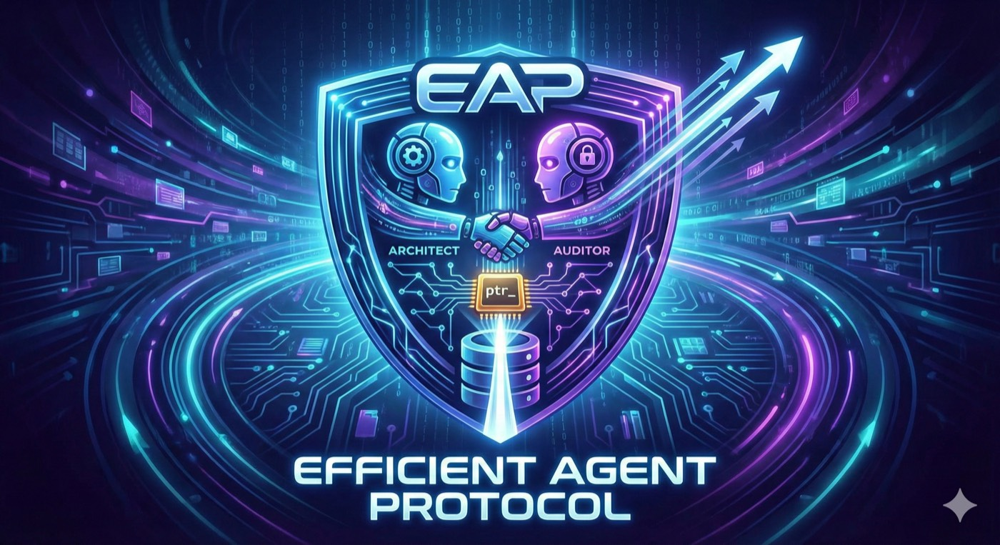

# Efficient Agent Protocol (EAP)

[](https://github.com/GenieWeenie/efficient-agent-protocol/actions/workflows/ci.yml)
[](https://github.com/GenieWeenie/efficient-agent-protocol/actions/workflows/ci.yml)
[](./pyproject.toml)
[](https://github.com/GenieWeenie/efficient-agent-protocol/releases)

> Status: Experimental (pre-1.0). APIs and schema may change.
> See `STABILITY.md` and `ROADMAP.md` for guarantees and planned milestones.
> Latest stable release: `v0.1.8`

Efficient Agent Protocol is a local-first framework for multi-step tool workflows.
It stores large outputs as pointer-backed state (`ptr_*`) and runs dependency-aware DAG steps in parallel.
It also ships OpenClaw interop paths for gateway/tool integration.

## 30-Second Pitch

- EAP is the reliability layer for agent workflows: deterministic execution, resumable runs, and pointer-backed state.
- It is built for local-first teams that need control over failure behavior, replayability, and traceability.
- It integrates with existing ecosystems instead of forcing a rewrite (`chat_completions`, `responses`, OpenClaw tooling, MCP tools).

See `docs/eap_proof_sheet.md` for reproducible evidence and command-level validation.

## What We Closed Recently

- OpenClaw interoperability moved from spike to shipped paths:
  - plugin adapter + skill pack
  - gateway `/tools/invoke` bridge
  - agent-routing header support
- Runtime control plane shipped with scoped auth and ownership governance:
  - execute/run-summary/pointer-summary/resume endpoints
  - policy guardrails with deterministic JSON errors
- Reliability hardening is now CI-enforced:
  - eval scorecard gate
  - competitive benchmark lane
  - soak + chaos reliability gate with regression thresholds
- Crash-safe resume/replay and MCP tool bridge are implemented and covered by integration tests.
- Self-hosted reference stack, telemetry export pack, and runbooks are in-repo and exercised in CI smoke lanes.

## Demo Flow

Short flow: chat request -> pointer inspection -> trace/HITL checkpoint.



## Architecture At A Glance

High-level runtime architecture (planning -> execution -> pointers/state -> API/UI).



## Why Choose EAP

| If you need | EAP gives you |
| --- | --- |
| Large outputs without prompt bloat | Pointer-backed state (`ptr_*`) passed between steps |
| Predictable behavior under failure | DAG scheduling, retries, typed errors, and checkpointed resume/replay |
| Human control at critical steps | Step-level HITL checkpoints (`approval_required`, `approved`, `rejected`) |
| Operator-grade confidence | Trace visibility, telemetry export pack, and CI eval threshold gates |
| Portability across runtimes | OpenAI-compatible providers + OpenClaw bridge + MCP bridge |

## Where EAP Fits

Best for:
- Python developers building local-first orchestration with explicit execution semantics.
- Teams that care about observability, replayability, and controlled failure behavior.

Not ideal yet:
- strict long-term API compatibility requirements before `v1.0`
- teams expecting a fully managed hosted control plane (instead of self-hosting runtime components)
- non-technical users wanting no-ops onboarding without any runtime/provider configuration

## Current Limits (Honest)

- Pre-1.0 contract: APIs and schema can still change (`STABILITY.md`).
- `responses` streaming behavior still depends on gateway SSE support and may vary by gateway version/configuration.
- Performance/reliability thresholds are calibrated from repo baselines; production teams should tune them for their own workloads.
- This remains an engineering-first runtime, not a no-code orchestration product.

## What You Get

- Pointer-based state to keep prompts small
- Parallel DAG execution with retries and validation
- Human-in-the-loop checkpoints (`approval_required`, `approved`, `rejected`)
- Crash-safe resume/replay from persisted run checkpoints
- Evaluation harness with CI threshold gates (`scripts/eval_scorecard.py`)
- Operator telemetry pack export (`scripts/export_telemetry_pack.py`)
- Self-hosted control-plane reference stack (`deploy/self_hosted/docker-compose.yml`)
- Scoped runtime auth + run ownership governance for remote operations
- Built-in chat UI (Streamlit) with trace + data inspection
- Conversation memory (full/window/summary)
- Pluggable pointer storage backends (SQLite, Redis, PostgreSQL)
- OpenClaw and MCP interop:
  - OpenAI-compatible modes: `chat_completions` and `responses`
  - Gateway tool bridge for `POST /tools/invoke`
  - OpenClaw plugin + skills starter package in `integrations/openclaw/eap-runtime-plugin`
  - MCP tool bridge (`invoke_mcp_tool`)

## Why Not Just Use A Generic Agent Framework?

- If you mainly need prompting convenience and managed UX, a platform suite may be simpler.
- If you need explicit run-state contracts, replayability, and pointer-backed payload discipline, EAP is a stronger fit.
- If you need to integrate with OpenClaw without rewriting your runtime, EAP now has first-party bridge paths.

## Quickstart (GitHub-first)

Requirements:
- Python 3.9-3.13 (3.11 recommended)

Recommended one-command bootstrap (macOS/Linux):

```bash
git clone https://github.com/GenieWeenie/efficient-agent-protocol.git
cd efficient-agent-protocol
./scripts/bootstrap_local.sh
```

Expected output includes:
- `Smoke workflow succeeded.`
- `Trace artifact: .../artifacts/bootstrap/bootstrap_trace.json`

Windows fallback:
- Use WSL2 (Ubuntu) and run the same bootstrap command inside WSL.
- If you are not using WSL2, follow the manual setup path below.

Manual setup (cross-platform):

1. Install package

```bash
pip install -e .
```

2. Configure

```bash
python scripts/eap_doctor.py init-env --output .env --force
```

Minimum variables:

```bash
EAP_BASE_URL=http://localhost:1234
EAP_MODEL=nemotron-orchestrator-8b
EAP_API_KEY=not-needed
```

3. Smoke test

```bash
python -m examples.01_minimal
```

4. Run doctor diagnostics

```bash
python scripts/eap_doctor.py doctor --env-file .env --output-json artifacts/doctor/diagnostics.json
```

5. Run dashboard

```bash
pip install streamlit pandas
streamlit run app.py  # from the repository root
```

6. Use it

- Open `http://localhost:8501`
- In **Agent Chat**, ask for a task
- Check **Data Inspector** for pointer payloads
- Check **Execution Trace** for step timing/retries/errors

7. Try starter packs

```bash
python -m starter_packs.research_assistant --question "What are launch risks?"
python -m starter_packs.doc_ops --focus "summarize priorities and actions"
python -m starter_packs.local_etl
```

8. Optional OpenClaw smoke check

```bash
./scripts/interop_openclaw_smoke.sh v2026.2.22
```

9. Optional self-hosted reference stack

```bash
cp deploy/self_hosted/.env.example deploy/self_hosted/.env
docker compose --env-file deploy/self_hosted/.env -f deploy/self_hosted/docker-compose.yml up --build -d
python scripts/self_hosted_stack_smoke.py --base-url http://127.0.0.1:8080 --bearer-token "<runtime-token>"
```

10. Architecture + extension deep dives

- `docs/architecture.md`
- `docs/custom_tool_authoring.md`
- `docs/pointer_internals.md`

## Programmatic Example

```python
import asyncio
from eap.protocol import StateManager
from eap.environment import AsyncLocalExecutor, ToolRegistry
from eap.environment.tools import read_local_file, READ_FILE_SCHEMA
from eap.agent import AgentClient

state_manager = StateManager()
registry = ToolRegistry()
registry.register("read_local_file", read_local_file, READ_FILE_SCHEMA)
executor = AsyncLocalExecutor(state_manager, registry)

architect = AgentClient(
    base_url="http://localhost:1234",
    model_name="nemotron-orchestrator-8b",
    provider_name="local",
)

manifest = registry.get_agent_manifest()
macro = architect.generate_macro("Read README.md and summarize setup steps", manifest)
result = asyncio.run(executor.execute_macro(macro))
print(result)
```

## Common Commands

```bash
./scripts/bootstrap_local.sh
python scripts/eap_doctor.py init-env --output .env --force
python scripts/eap_doctor.py doctor --env-file .env --output-json artifacts/doctor/diagnostics.json
python3 -m pytest -q
pre-commit run --all-files
python3 scripts/migrate_state_db.py --db-path agent_state.db --dry-run
python3 scripts/export_metrics.py --db-path agent_state.db --output metrics/latest.json
python3 scripts/export_telemetry_pack.py --db-path agent_state.db --output-dir artifacts/telemetry
python scripts/eap_state_backup.py backup --db-path agent_state.db --output-root artifacts/state_backups
python scripts/soak_chaos_scorecard.py --output-dir artifacts/soak_chaos --threshold-config docs/soak_chaos_thresholds.json --baseline docs/soak_chaos_baseline.json
./scripts/interop_openclaw_smoke.sh v2026.2.22
docker compose --env-file deploy/self_hosted/.env -f deploy/self_hosted/docker-compose.yml up --build -d
python scripts/self_hosted_stack_smoke.py --base-url http://127.0.0.1:8080 --bearer-token "<runtime-token>"
python3 -m build
```

## Docs

Full documentation index: [`docs/README.md`](docs/README.md)

- Start here:
  - `docs/eap_proof_sheet.md`
  - `docs/configuration.md`
  - `docs/architecture.md`
  - `docs/custom_tool_authoring.md`
  - `docs/pointer_internals.md`
  - `docs/troubleshooting.md`
- Contract and policy:
  - `STABILITY.md`
  - `ROADMAP.md`
  - `docs/v1_contract.md`
  - `docs/typing_policy.md`
  - `SECURITY.md`
  - `CONTRIBUTING.md`
- Runtime and operations:
  - `docs/workflow_schema.md`
  - `docs/tools.md`
  - `docs/observability.md`
  - `docs/operator_telemetry_pack.md`
  - `docs/state_backup_restore.md`
  - `docs/soak_chaos_reliability.md`
  - `docs/self_hosted_control_plane.md`
  - `docs/remote_ops_governance.md`
  - `docs/migrations.md`
- Interop and starter packs:
  - `docs/openclaw_interop.md`
  - `integrations/openclaw/eap-runtime-plugin/README.md`
  - `docs/starter_packs/README.md`
- GitHub roadmap board: https://github.com/users/GenieWeenie/projects/1
